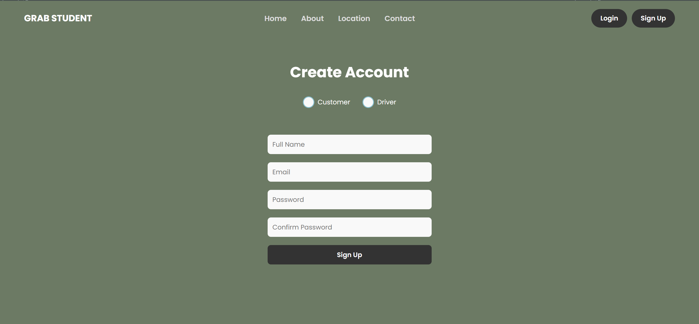
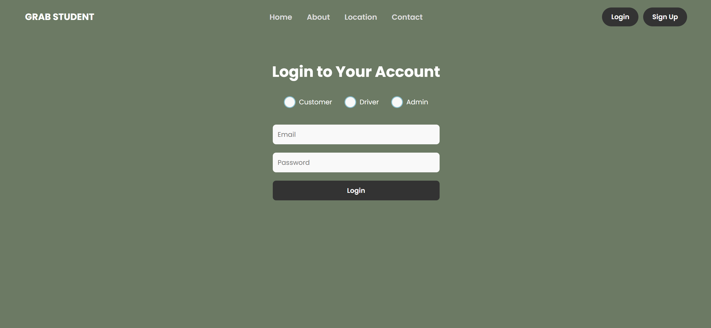
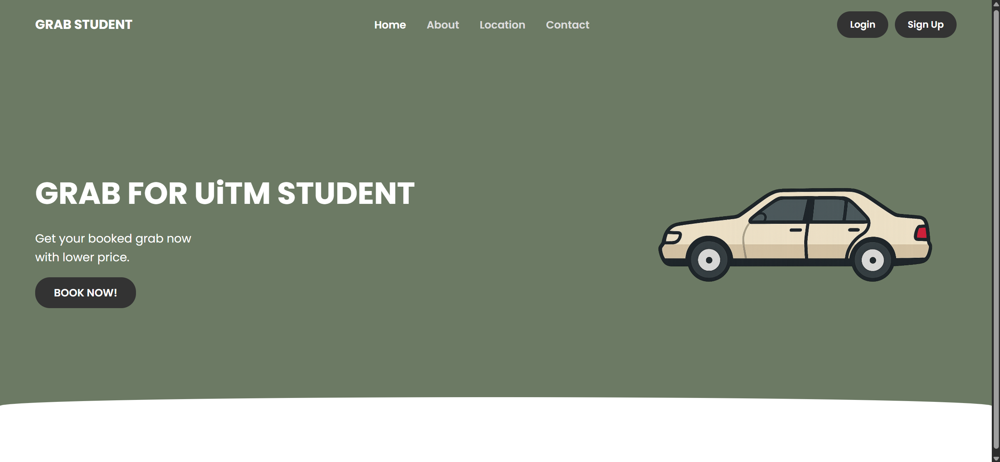
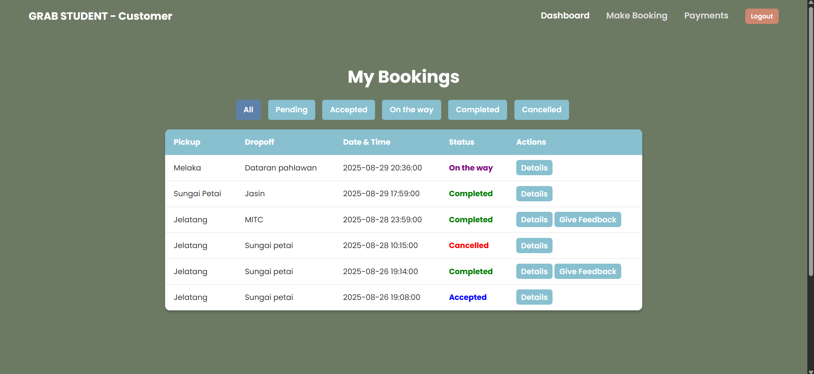
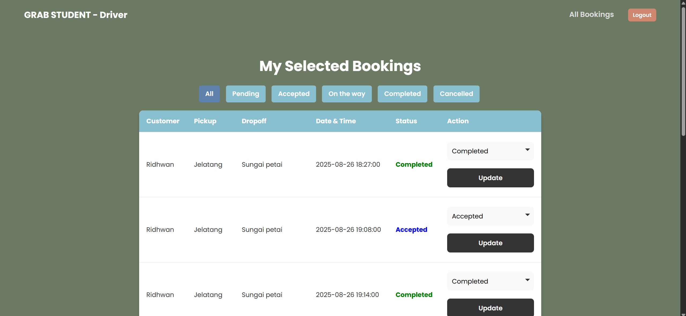
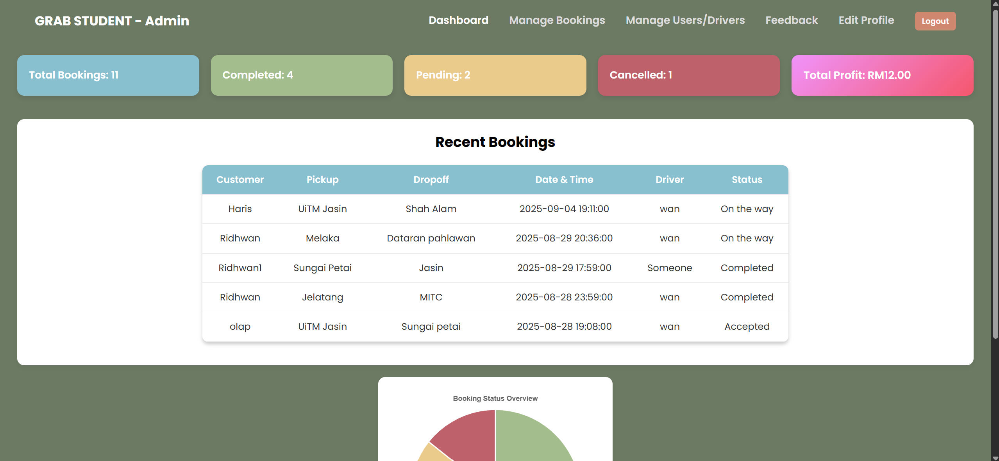

# GrabStudent

GrabStudent is a web-based platform designed to streamline booking and feedback for students using Grab services. This project was created to explore how **Python** can be used to build web applications and is my **first project using Python** for a website. The application supports **Customers, Admins, and Drivers**.

- Customers can book rides, track statuses, and submit feedback.  
- Drivers can view available bookings, select them, update statuses, and notify customers.  
- Admins can oversee all bookings and feedback.

---

## Features

### 📋 Customer Dashboard

- **View All Bookings:** Customers can see all the bookings they have made.  
- **Status Filtering:** Easily filter bookings by status (Pending, Accepted, On the way, Completed, Cancelled).  
- **Booking Actions:**  
  - **Details:** View detailed information about each booking.  
  - **Delete:** Remove a booking if desired.  
  - **Give Feedback:** If a booking is completed and feedback has not yet been submitted, a "Give Feedback" button appears next to the details button.  
- **Feedback Section:**  
  - View all feedback previously submitted.  
  - Edit any existing feedback.  
- **Navbar (Top-Left):**  
  - **Dashboard:** Main bookings overview.  
  - **Make Booking:** Navigate to the booking form to create a new booking.  
  - **Payments:** View all bookings made and complete payment for them.  
  - **Logout:** Log out securely from the account.


### 🧑‍💻 Admin Dashboard

- **Dashboard Overview:**  
  - View total bookings with breakdown by status (Pending, Accepted, On the way, Completed, Cancelled).  
  - Track total profit.  
  - See all recent customer bookings.  
  - Visualize bookings by status with a pie chart (Pending, Cancelled, Completed).

- **Navbar:**  
  - **Manage Bookings:** Access all customer bookings.  
    - Filter by status, assigned driver, and date range.  
    - Delete bookings if necessary.  
  - **Manage Users/Drivers:**  
    - View all registered customers and drivers.  
    - Edit or delete user accounts.  
  - **Feedback:**  
    - View all customer feedback.  
    - Delete feedback if required.  
  - **Edit Profile:**  
    - Update the admin’s own profile details.  
  - **Logout:** Securely log out of the system.


### 🚗 Driver Dashboard

- **Available Bookings:**  
  - Upon login, drivers see all customer bookings that have not yet been assigned to another driver.  
  - Drivers can select a booking to take responsibility for it.
  - When a booking is selected by a driver then an email is sent to the customer to notify them.

- **My Bookings:**  
  - Drivers can view all bookings they have accepted.  
  - Use a dropdown to filter bookings by status: Pending, Accepted, On the way, Completed, Cancelled.  
  - A button allows updating the booking status.  
  - When a booking status is updated, an email is sent to the customer notifying them of the change.

- **Navbar:**  
  - **Available Bookings:** Shows all unassigned bookings.  
  - **My Bookings:** Displays the driver’s accepted bookings with filtering options.  
  - **Logout:** Securely log out of the system.


---

## Technologies Used
- **Backend:** Python with Flask
- **Frontend:** HTML, CSS, JavaScript
- **Database:** MySQL

---

## Screenshots

<p float="left">
  
  
  
</p>

<p float="left">
  
  
  
</p>

---

## Setup Instructions

## Database Setup

This project includes a MySQL database schema file `grabstudent(3).sql`. Follow these steps to set it up:

1. Make sure you have MySQL installed.
2. Open your MySQL client (e.g., phpMyAdmin or MySQL Workbench).
3. Create a new database:

```sql
CREATE DATABASE grabstudent;
USE grabstudent;

### Prerequisites
- Python 3.8+
- MySQL Server
- Flask
- Flask-MySQLdb
```

### Installation Steps

#### 1. Clone the Repository
```bash
git clone https://github.com/RidhwanHazian/GrabStudent.git
cd GrabStudent
```

#### 2. Create and Activate a Virtual Environment (Windows)
```bash
python -m venv venv
venv\Scripts\activate
```
> For macOS/Linux:
```bash
python3 -m venv venv
source venv/bin/activate
```

#### 3. Install Dependencies
```bash
pip install -r requirements.txt
```

#### 4. Set Up the Database
1. Open MySQL or phpMyAdmin.
2. Create the database and import the schema:
```sql
CREATE DATABASE grabstudent;
USE grabstudent;
SOURCE grabstudent.sql;
```

#### 5. Configure the Application
Update the database connection in `app.py`:
```python
app.config['MYSQL_HOST'] = 'localhost'
app.config['MYSQL_USER'] = 'your_username'
app.config['MYSQL_PASSWORD'] = 'your_password'
app.config['MYSQL_DB'] = 'grabstudent'
```

#### 6. Run the Application
```bash
py app.py
```
> Or if `py` doesn’t work:
```bash
python app.py
```

The application will be accessible at: [http://localhost:5000](http://localhost:5000)

---

## Usage

### Customer Access
- Navigate to `/customer/dashboard` to view and manage bookings.
- Make new bookings using the "Make Booking" page.
- View all submitted feedback and edit if needed.
- Complete payments for bookings via the "Payments" page.

### Driver Access
- Navigate to `/driver` to view available bookings.
- Select a booking to take responsibility for it.
- View all accepted bookings in "My Bookings".
- When a booking is selected by a driver, an email notification is sent to the customer.
- Use the status dropdown to update bookings (Pending, Accepted, On the way, Completed, Cancelled).
- When a booking status is updated, an email notification is sent to the customer.

### Admin Access
- Navigate to `/admin/dashboard` to manage all customer bookings and feedback.
- Use "Manage Bookings" to filter by status, driver, or date range, and delete bookings if needed.
- Manage all users and drivers via "Manage Users/Drivers".
- View and delete customer feedback in the "Feedback" section.
- Edit your own admin profile in "Edit Profile", including changing your password.

---

## Contributing

- **[Ridhwan](https://github.com/RidhwanHazian)** – *Programmer*  
  (Python, HTML, CSS, JavaScript)  
  Responsible for full implementation and integration.  

- **[Adam Mirza](https://github.com/AdamMirza-crypto)** – *Interface Designer*  
  Created the storyboard UI interface and designs in Canva (no coding).  

- **[Haris Naszim](https://github.com/Dat1n)** – *Quality Assurance (QA)*  
  Responsible for testing the application, reporting bugs, and ensuring quality.  
  
Contributions are welcome! Please fork the repository, create a new branch, and submit a pull request with your proposed changes.

---

## License

MIT License

Copyright (c) 2025 Muhammad Ridhwan bin Hazian

Permission is hereby granted, free of charge, to any person obtaining a copy
of this software and associated documentation files (the "Software"), to deal
in the Software without restriction, including without limitation the rights
to use, copy, modify, merge, publish, distribute, sublicense, and/or sell
copies of the Software, and to permit persons to whom the Software is
furnished to do so, subject to the following conditions:

The above copyright notice and this permission notice shall be included in all
copies or substantial portions of the Software.

THE SOFTWARE IS PROVIDED "AS IS", WITHOUT WARRANTY OF ANY KIND, EXPRESS OR
IMPLIED, INCLUDING BUT NOT LIMITED TO THE WARRANTIES OF MERCHANTABILITY,
FITNESS FOR A PARTICULAR PURPOSE AND NONINFRINGEMENT. IN NO EVENT SHALL THE
AUTHORS OR COPYRIGHT HOLDERS BE LIABLE FOR ANY CLAIM, DAMAGES OR OTHER
LIABILITY, WHETHER IN AN ACTION OF CONTRACT, TORT OR OTHERWISE, ARISING FROM,
OUT OF OR IN CONNECTION WITH THE SOFTWARE OR THE USE OR OTHER DEALINGS IN THE
SOFTWARE.

